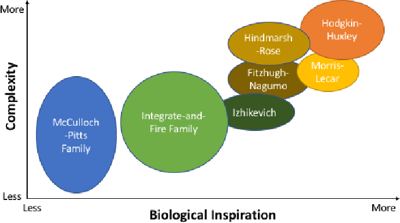
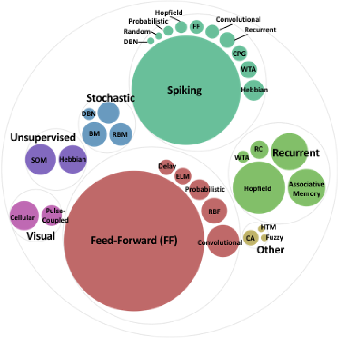
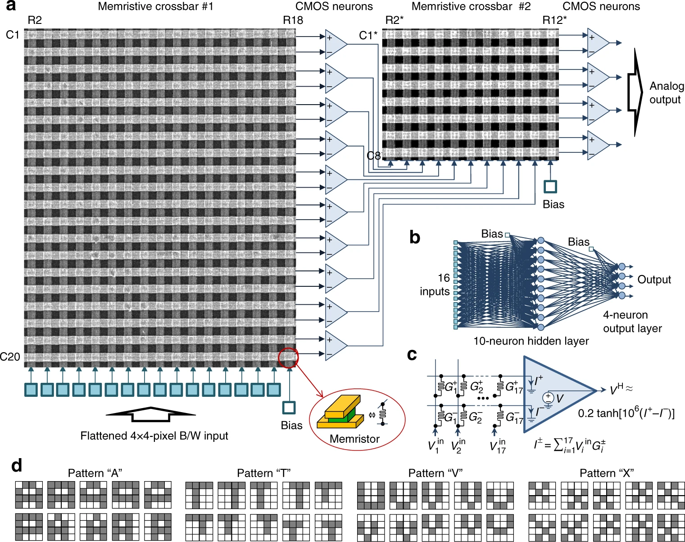
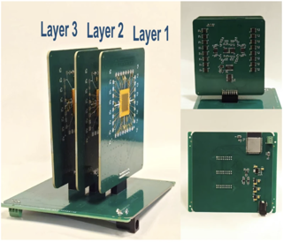
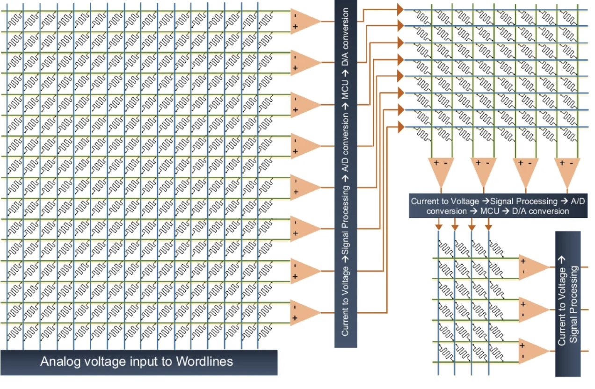
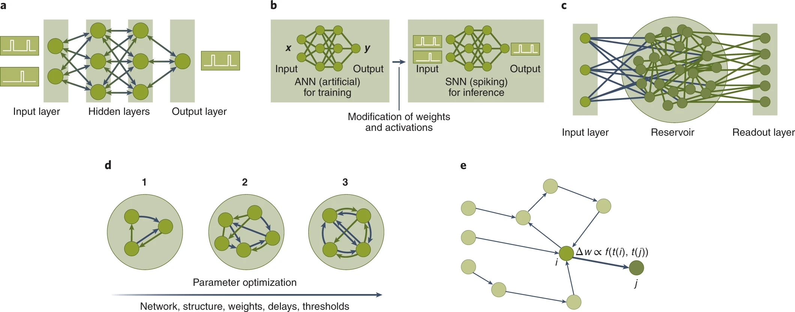

# Literature Review Update

James Carlyle

3 July 2026
Dr. Firman Simanjuntak
AI for Sustainability CDT
University of Southampton

## Introduction
I've looked at key themes and research findings from a set of foundational and recent papers on spiking neural networks (SNNs), memristor-based neural hardware, and neuromorphic control, with a focus on edge intelligence and hardware efficiency.

This forms a natural series of goups:

- Survey of synapse and neuron implementations in hardware.
- Spiking neural networks.
- Perceptrons - an application of neural networks.
- Training.
- Sensing.

I have also developed a small, high performance, multithreaded spiking neural network simulation in software.

# Key Themes

  
  

- Neuromorphic computers have the potential to perform complex calculations more power-efficiently and on a smaller footprint than traditional von Neumann architectures.
- Early focus on speed; faster neural network computation with custom chips than possible with traditional von Neumann architectures, exploiting natural parallelism, also custom hardware to complete neural-style computations. Especially for real-time control , real-time digital image reconstruction, and autonomous robot control.
- Later focus on power consumption and efficiency.
- Different levels of biological plausibility: biologically-plausible (seen in biological neural systems, e.g. Hodgkin-Huxley, Morris Lecar), biologically-inspired (replicate behavior of neural systems but not in a biologically-plausible way, e.g. Izhikevich), neuron models such as integrate-and-fire (especially Leaky) and McCulloch-Pitts (activation functions, e.g. sigmoid, tanh).

# Key Challenges for Memristor Arrays and Spiking Networks
- **Device variability and imperfections** in memristive/analog crossbars cause weight noise, conductance drift, and cycle-to-cycle fluctuations that degrade inference accuracy and complicate training.
- **Non-ideal memristor dynamics** (non-linear weight updates, asymmetric potentiation/depression, retention loss, endurance limits) break assumptions of backpropagation and STDP.
- **Non-differentiable spiking** require surrogate gradients (SG) or ANN-to-SNN conversion; SG introduces approximation bias, memory-intensive BPTT, and poor biological plausibility.
- **Biological plausibility vs. engineering utility**: e.g. STDP is scientifically interesting but underperforms SG.
- **No consensus on computational primitives**: rate vs. temporal vs. population coding; integrate-and-fire vs. Izhikevich vs. Hodgkin-Huxley; local vs. global learning.
- **Generalization gap**: SNNs perform on temporal or sparse tasks but lack demonstrated reasoning, language, or planning capabilities of transformer-scale digital NNs.
- **No killer application** justifying neuromorphic large-scale production cost (>\$50M); edge AI applications served by low-power Microcontroller and Neural Processing Units, e.g. Texas Instruments TinyEngine NPU.

# Surveys
- **A survey of neuromorphic computing and neural networks in hardware. (Schuman, Catherine D., et al., arXiv 2017)**
  - Key findings: A survey of neuro-inspired models, algorithms and learning approaches, hardware and devices, supporting systems, and finally applications. Provides a taxonomy of digital, analog, and mixed-signal neuromorphic systems (e.g., TrueNorth, SpiNNaker) and device-level components (memristors, CBRAM, phase-change, spintronic, floating-gate, optical) used for neurons/synapses. Large-scale literature synthesis (2000+ references) mapping algorithm choice (backpropagation, evolutionary, Hebbian/STDP) to hardware constraints.
- **Opportunities for neuromorphic computing algorithms and applications (Catherine D. Schuman et al., Nature Computational Science, 2022)**
  - Key findings: Spiking neural network algorithms fall into machine-learning (quasi-backpropagation, ANN-to-SNN mapping, reservoir computing, evolutionary, plasticity/STDP) and non-machine-learning (graph theory, random walks, NP-complete problem solving). There is a lack of readily accessible and usable software and hardware systems, preventing uptake, and a lack of clearly established benchmarks, metrics and challenge problems. No algorithm-application pairing yet shows neuromorphic computers outperforming deep learning in accuracy. Three main use cases identified: edge-computing (for example, vehicles, drones, robotics, remote sensing, IoT), accelerators in smart phones and PCs with orders of magnitude less power, and as co-processors for spike-based simulations, graph algorithms and differential equations.

# Surveys
- **Memristor-Based Artificial Neural Networks for Hardware Neuromorphic Computing (Jin et al., 2025)**
  - Key findings: Comprehensive review showing memristor crossbar integration (passive 0T1R, 1T1R, 1S1R, memtransistor) can implement artificial neurons (LIF, integrate-and-fire), synapses (STDP, LTP/LTD), and full network architectures (CNN, RNN/LSTM, reservoir computing, SNN) across multiple emerging materials (metal oxides, perovskites, 2D materials, chalcogenides). Provides a taxonomy linking memristor materials (0D–3D structures, RRAM/PCM/FTJ/MRAM) to neural architectures, and identifies low per-spike energy (<30 aJ–200 fJ) flexible synapse designs for wearable neuromorphic systems.
- **Memristor Synapse—A Device-Level Critical Review (Chandrasekaran, Chang, Simanjuntak, 2026)**
  - Key findings: Statistical analysis (2018–2025) shows resistive/phase-change memristive systems dominate publication growth. Device-level classification of biomimetic plasticity (STP, LTP, STDP, SRDP).  Optoelectronic 2D-material synapses can be tuned via light pulses, broadening memristor controllability beyond electrical stimulation. Survey of practical applications ranging including hardware-based pattern recognition and artificial retinal implants, key organ interfaces, and artificial vision systems in healthcare.

# Spiking Neural Networks - Datasets
- **Converting Static Image Datasets to Spiking Neuromorphic Datasets Using Saccades (Garrick Orchard et al., Frontiers of Neuroscience, 2015)**
  - Key findings: Created a method for converting existing computer vision static image datasets (e.g. MNIST) into spiking datasets using an actuated pan-tilt camera platform, and assessed the generated datasets against existing SNN algorithms. The N-MNIST dataset is extensively referenced and provided as an example in popular spiking frameworks such as Tonic, snnTorch, Sinabs.
- **20-05 ST-MNIST: The Spiking Tactile-MNIST Neuromorphic Dataset**
  - Key findings: Event-based tactile sensing and dataset, which introduces a neuromorphic tactile dataset with 100-taxel ACES skin and benchmarks ANN/SNN models on handwritten digits. Addresses a shortage of neuromorphic event-based tactile datasets, principally due to the scarcity of large-scale event-based tactile sensors (evaluating spiking neural networks on conventional frame-based datasets is  sub-optimal).

# Spiking Neural Networks - Algorithms
- **Spiking neural networks for computer vision (Hopkins et al., Interface Focus 2018)**
  - Key findings: Conventional frame-based cameras produce highly redundant data streams, but biological vision uses sparse, event-based spikes triggered by luminance changes. Retina-inspired event-based vision sensors (EVS) produce sparse representations that emphasize edges and salient features. A spiking motion-sensing network combining slow/fast synaptic dynamics with axonal delays reliably detects apparent motion in event streams (e.g., a bouncing ball) via coincidence detection. Structural synaptic plasticity on SpiNNaker can support handwritten digit classification with modest accuracy, illustrating unsupervised feature learning. Dendritic branches can be viewed as Maximum Entropy samplers over input patterns, suggesting an information-theoretic perspective on how neurons form sparse, efficient codes.
- **Advancements in Algorithms and Neuromorphic Hardware for Spiking Neural Networks (Javanshir et al., Neural Computation, 2022)**
  - Key findings: FPGA-based SNN implementations achieve substantial power savings (up to 293x) compared to GPU/CPU baselines across MNIST, CIFAR-10, and speech benchmarks. Spiking neural networks (SNNs) use discrete spikes and stateful neuron models (e.g., LIF, Izhikevich). Different neuron models trade off biological realism and computational cost; Hodgkin–Huxley is  accurate but expensive; LIF is simple, fast, and widely used. Spike-based information encoding schemes (rate, latency, rank-order, phase, and population coding) strongly influence SNN performance. SNN training strategies: unsupervised STDP-based learning, supervised spike-based backpropagation, ANN-to-SNN conversion, and evolutionary weight optimization. Existing neuromorphic platforms (TrueNorth, Loihi, SpiNNaker, BrainScaleS, Neurogrid) differ markedly in neuron models, synapse precision, scalability, and on-chip learning support. Comparative review table of 15+ FPGA-based SNN designs across encoding schemes (rate, temporal, population) and conversion methods (ANN-to-SNN), highlighting hybrid time-stepped/event-driven updating as most efficient.         

# Spiking Neural Networks - Algorithms
- **Attention Spiking Neural Networks (Man Yao et al, IEEE Machine Intelligence 2023)**
  - Key findings: Introduces multi-dimensional attention (temporal, channel, spatial) into spiking neural networks (SNNs) to optimize membrane potentials and spiking response, achieving top-1 accuracy of 75% on ImageNet-1K, closing the performance gap with ANNs to within roughly 1% while improving energy efficiency 31×. Resolves spiking degradation / gradient vanishing in deep SNNs via block dynamical isometry theory, and introduces a spiking response visualization method to analyze attention effectiveness.
- **Memristor-Based Spiking Neuromorphic Systems Toward Brain-Inspired Perception and Computing (Xiangjing Wang et al., MDPI Nanomaterials 2025)**
  - Key findings: Review of how Threshold Switching Memristors (TSMs) emulate diverse spiking behaviors—including oscillatory, LIF, Hodgkin–Huxley, and stochastic dynamics for redox and Mott-type TSMs. TSMs offer intrinsic sub-pJ spiking, <30 ns latency, and nanoscale footprints compatible with ≥ 1000 neurons / cm2. Looks at key challenges, such as stochastic switching origins, device variability, and endurance limits.

# Spiking Neural Networks - Algorithms
- **Design of Highly-Accurate and Hardware-Efficient Spiking Neural Networks (Tang Han, IEEE TCAS-AI, 2025)**
  - Key findings: Introduces weight-binarized SNN (WB-SNN), a stochastic SNN with two unique features: a shared random
  number generator (RNG) for all input neurons, and reduced connections to subsequent neurons through a priority encoder
  (PE) to reduce FPGA hardware requirements. Tests a WB-SNN-based CNN for CIFAR-10 and MNIST, achieving major memory savings with minimal accuracy loss compared with prior stochastic SNN designs. (Note to self: stochasticity can relate to threshold values, synapse weights or randomised blocks; binary NN suffer from undifferentiability, but probabalistic binary NN remain differentiable for back propagation.)
- **An Energy- and Endurance-Aware Hybrid CMOS–SDC Memristor Convolutional Spiking Neural Network for Edge Intelligence (Jun Sung Go / Jong Tae Kim, MDPI Electronics 2026)**
  - Key findings: Hybrid Convolutional Spiking neural network integrates digital Non-Leaky Integrate-and-Fire (NLIF) neurons with Knowm Self-Directed Channel (SDC) memristor-based synapses in a 1T1R crossbar array, streamlined readout circuit utilizing a Current Sense Amplifier (CSA) and a 1-bit comparator instead of ADCs for 18.4% of the energy required by an 8-bit ADC-based approach while maintaining negligible accuracy loss, intensity-to-latency temporal coding scheme to minimize spike activity and mitigate device endurance degradation. Argues that a digital neuron design provides deterministic integration and precise timing control needed. On chip unsupervised learning combines STDP with a Winner-Takes-All (WTA) mechanism to ensure feature diversity. STDP Controller instructs a pulse generator to emit the corresponding forward and backward voltage pulses necessary to induce LTP or LTD within the memristor array.

# Perceptrons

  

- **Implementation of multilayer perceptron network with highly uniform passive memristive crossbar circuits (Bayat et al., Nature Communications 2018)**
  - Key findings: Highly uniform passive metal-oxide memristor crossbars can reliably implement analog weight matrices for a mixed-signal multilayer perceptron (MLP) with CMOS neurons. Hardware-aware ex-situ training that accounts for device nonidealities yields better experimental small-image classification fidelity than hardware-oblivious training, but in-situ training with fixed-amplitude pulses achieves lower classification performance than ex-situ approaches, largely due to its limited ability to compensate device threshold variability. Temperature-dependent conductance variations can be partially mitigated by differential synapse designs and by operating devices in higher-conductance regimes.
- **Perceptrons from Memristors (Silva et al., Neural Networks, 2020)**
  - Key findings: Single- and multilayer perceptrons implementing both neurons and synapses entirely from memristors which satisfy the Minsky–Papert theorem and behave as expected for perceptron models, proving memristive circuits are universal function approximators and paving the way for fully memristive neural hardware. Provides a modified backpropagation algorithm.
# Perceptrons

  
  

- **Ultra-high density perovskite nanowire array memristor-based multi-layer perceptron (Swapnadeep Poddar et al, Nature Communications 2026)**
  - Key findings: A 3D vertically-aligned perovskite nanowire array embedded in a porous alumina membrane, achieved 139 non-overlapping analog conductance states, endurance of 4×10^5 cycles, and low device-to-device (5%) and cycle-to-cycle (1.5%) variability. Large 64×64 passive halide-perovskite crossbar array, physically wired into a three-layer memristor-based multi-layer perceptron performed on-chip regression/classification of zebrafish strike kinematics with 94% accuracy.

# Training

- **Evolving Spiking Neurocontrollers for UAVs (H. Qiu et al., IEEE Symposium, 2020)**
  - Key findings: Evolving spiking neurocontrollers for UAVs using NEAT, which provides a model for fitness improvement through topology mutation (add neurons and synapses), crossover, inheritance, and extinction. Demonstrates 6-degree hexacopter control with modular SNN controllers evolved by NEAT, outperforming tuned PID in simulation.

# Training
- **Learned adaptive properties for mitigation of weight perturbations in embedded spiking networks (Sarah Luca et al, Frontiers in Neuroscience, 2026)**
  - Key findings: Demonstrate that adaptive voltage thresholds or neuronal time constants can enable network-level mechanisms to recover from perturbed synaptic weights; effective for recurrent networks, by modulating network level dynamics to recover performance in image classification tasks and spatiotemporal tracking tasks under Gaussian noise or perturbations when exposed to ionizing radiation. "Context" may modulate either the time constant of the soma through the transistor, or change the threshold.
- **Energy-Efficient Training of Memristor Crossbar-Based Multi-Layer Neural Networks(Raqibul Hasan et al., MDPI Chips, 2025)**
  - Key findings: An efficient on-chip training circuit for memristor crossbar-based multi-layer neural networks, storing the training error product of two analog signals directly in a memristor device, eliminating the need for ADC and DAC converters and allowing backpropagation entirely within the analog domain. Twice as energy efficient and 1.5 times faster than existing memristor-based systems for training multi-layer neural networks.
- **Frequency Switching Neuristor for Realizing Intrinsic Plasticity and Enabling Robust Neuromorphic Computing (Woojoon Park, Advanced Materials, 2025)**
  - Key findings: Combining a volatile Mott memristor with a non-volatile valence change memory(VCM) memristor, the FS neuristor acts as a modifiable activation function and achieves programmable frequency–voltage(f–V) characteristics similar to the transfer functions of neuronal intrinsic plasticity - simply, the spiking frequency generated for a given voltage can be changed through sensitisation and desensitisation. e.g. applying intrinsic plasticity using the FS neuristor during the fine-tuning phase of dense spiking network pruning can significantly reduce degradation caused by pruning.

# Training
- **A Hebbian Learning based Spiking Neuromorphic Hardware Accelerator with ReRAM (Hokenmaier et al., MDTS 2025)**
  - _NB. Funded commercially, limited peer appraisal._ Key findings: The proposed spiking neuromorphic accelerator uses asynchronous leaky integrate-and-fire neurons and resistive memory synapses to avoid global clocks and operate purely in an event-driven manner. Simulations of a small 2×2 SNN core show that spike train frequency scales with input current, enabling controllable neuron firing rates and demonstrating correct leaky integrate-and-fire behavior. Implements Hebbian learning in hardware via in-situ programming pulses applied immediately after neuron firing, enabling unsupervised adaptation without external control. Presents a ReRAM scaling roadmap suggesting that future chips could host hundreds of millions of synaptic parameters, moving spiking ReRAM-based accelerators closer to state-of-the-art AI model sizes.
- **Memory-Dependent Computation and Learning in Spiking Neural Networks Through Hebbian Plasticity (Thomas Limbacher et al., IEEE Transactions Neural, 2025)**
  - Key findings: Hebbian enrichment of SNNs improves versatility in terms of their computational as well as learning
    capabilities, improving abilities for out-of-distribution generalization, one-shot learning, cross-modal generative association, language processing, episodic reinforcement learning task, and attain a near-optimal strategy
    on Concentration (memory-based card pairing game). An encoder feeds inputs into key and value layers during storage, and into the key layer to extract values from the value layer during queries. 

# Sensing
- **Threshold-Switching Memristors for Neuromorphic Thermoreception (Haotian Li et al,. MDPI Sensors, 2025)**
  - Key findings: Bi2Se3-based threshold-switching memristors were presented in constructing temperature-sensing neural circuits, showing potential for biorealistic thermoreception applications. Limited interest.
- **DRiVE: Dynamic Recognition in VEhicles using snnTorch (Heerak Vora et al., Archiv Neural Computing, 2025)**
    - Key findings: Combines SNNs with snnTorch to test potential for image-based tasks. DRiVE, a vehicle detection model that uses spiking neuron dynamics to classify the Kaggle vehicle detection image set achieved 94.8% accuracy and a 0.99 AUC score. Two hidden layers of LIF neurons trained with with surrogate gradients. N.B. no information on rate or temporal encoding approach.
- **Dynamic machine vision with retinomorphic photomemristor reservoir computing (Hongwei Tan, Sebastiaan van Dijken, Nature Communications 2023)**
  - Key findings: Motion recognition and prediction in recurrent photomemristor networks for dynamic machine vision. 5×5 array of ZnO-based recurrent photomemristors can act as a retinomorphic in-sensor reservoir, simultaneously sensing light and performing temporal processing for dynamic machine vision tasks, with adjustable sensing and memory characteristics via bias control. Reservoir outputs with simple readout networks use the inherent dynamic memory of photomemristors to achieve accuracy in video word recognition and velocity classification (not possible with a single frame).
