# Event Processing and Spiking Neural Networks

James Carlyle

3 July 2026
Dr. Firman Simanjuntak
AI for Sustainability CDT
University of Southampton

# Introduction

  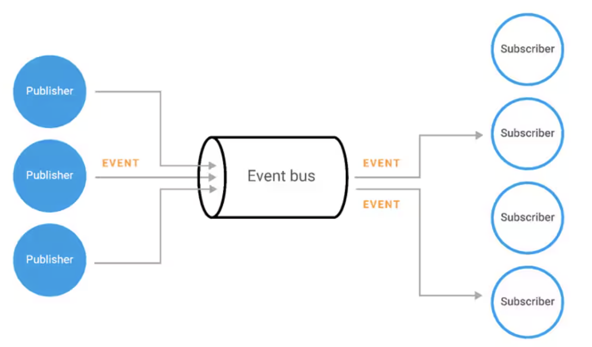
  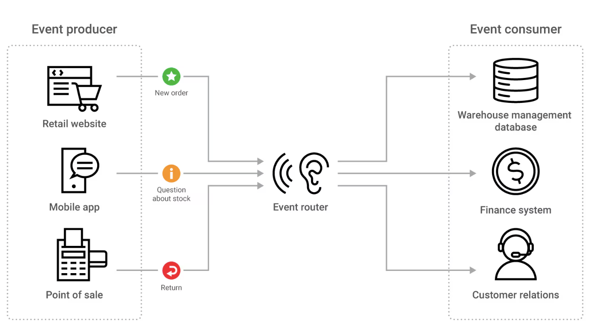

## Event-based processing
- Event-based computing is based on change, not state. 
- Internal or external event provides a trigger for the processing to be initiated, allows a system to react when something happens. 
- Processing is not happening all the time.
- System may consume less energy, or may react faster.
- Inbound and outbound streams are often disconnected, or can propagate.
- E.g. for banking app, the system can be idle, but when event (ATM withdrawal) arrives, account balance can be updated with very low latency. 

## Non event-based
- Alternatives are:
  - batch (system periodically processes groups of data), 
  - request/response(system responds to external requests using the same channel),
  - periodic polling (system generates its own requests).
- Can be efficient if iteration is required, and if latency is not a concern.

<!--
footer: 'Images: https://www.akamai.com/glossary/what-is-event-driven-architecture'
-->
# Spiking neural networks

  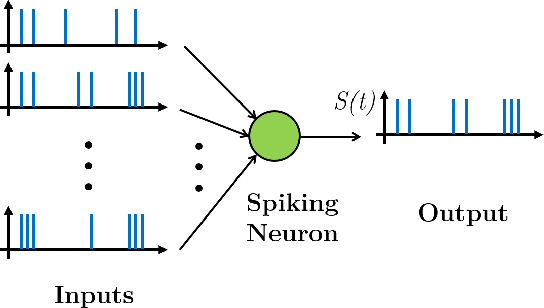
  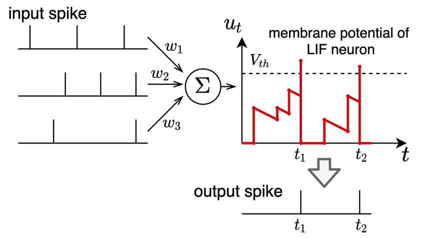

Spiking neural networks (SNN) are similar in structure to Artificial Neural Networks (ANN): 
- Layers of nodes; for SNN these are called neurons. 
- Weighted connections; for SNN these are synapses. 
- Sum ∑(inputs*weights) at the nodes.
- For SNN the input is a spike (a short time-interval signal of unit strength), accumulated in the neuron and subject to decay over time. 
- Node activation functions; for SNN the activation is determined by the accumulated, decayed spike-weight exceeding a threshold, causing the neuron to emit a new spike to downstream connected neurons via their connected synapses and then resetting.
- ANN are frame-based (i.e. all inputs are fed with a single sample, image at the same time), but SNN are continuous time-based (spikes have a timestamp, created by an external event).
<!--
footer: 'Images: https://www.researchgate.net/figure/LIF-neuron-When-spike-trains-of-the-previous-layer-neurons-enter-the-internal-membrane_fig2_355061651'
-->

# Spiking neural network inhibition
- Spiking networks often include inhibition, which is bio-plausible.
- Inhibition can be used to promote a 'winning' neuron, particularly in an output layer. The winning neuron sends a spike via a negatively-weighted synapse to other neurons.
- Inhibition can happen between neurons in a single layer, or between inhibitory and excitatory layers.

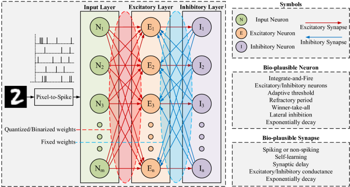

<!--
footer: 'Images: https://media.springernature.com/m685/springer-static/image/art%3A10.1007%2Fs00521-021-05832-y/MediaObjects/521_2021_5832_Fig1_HTML.png'
-->
# Encoding : Spike rate 
- Poisson (rate) coding converts inputs to spike trains whose firing rates approximate the underlying values, by comparing each input to a random number at every timestep and emitting spikes when the input is larger.  
- Widely used in early SNN work, especially for vision tasks like MNIST and ImageNet when combined with ANN–SNN conversion or surrogate training.  
- Benefits: conceptually simple, compatible with rate-based ANN intuitions, and easy to integrate into existing frameworks.  
- Drawbacks: requires many timesteps to reduce discretization noise and approximate analog activations, leading to high inference latency and energy cost; poorly suited to real-time or low-latency applications.  
- Largely superseded by more temporally efficient schemes for sequential tasks.

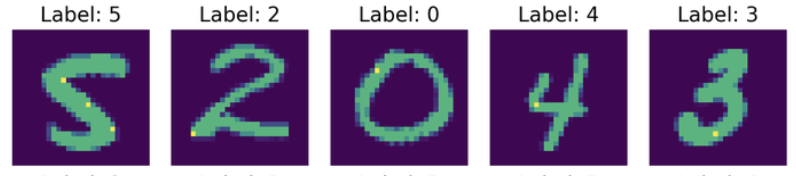
<!--
footer: 'Images: https://www.fabriziomusacchio.com/blog/2026-02-16-nervos_stdp_snn_simulation_on_mnist/'
-->
# Encoding : Spike timing
- Temporal coding schemes exploit spike timing to represent values or temporal correlations, including phase coding, burst coding, DCT-based encodings, temporal-switch coding, and time-to-first-spike (TTFS, where each neuron spikes once).  
- These methods seek to use fewer spikes and embed information in spike timing, reducing energy and latency compared to pure rate coding.  
- Mostly applied to static image classification, where SNNs process temporally structured encodings of otherwise static data.  
- Limitations: still require temporal windows; can introduce complexity in encoding/decoding; unclear benefits for sequential tasks (speech, text, event streams).  

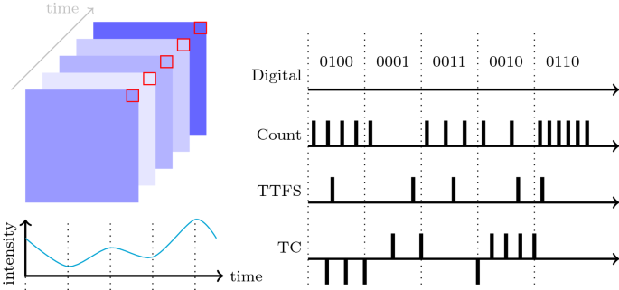
<!--
footer: 'Images: https://link.springer.com/article/10.1007/s11063-021-10562-2'
<!--
footer: ''
-->
# Encoding : Direct analog encoding (first layer as spike generator)
- Direct encoding feeds analog sensor values straight into the network and uses the first layer’s neurons themselves to generate spikes, avoiding an explicit analog-to-spike encoding stage.  
- Strong performance on ImageNet with very few timesteps, significantly reducing latency compared to rate or temporal schemes.  
- Can outperform other input coding methods for latency and efficiency; adopted for experiments on sequential tasks with analog inputs (e.g., speech, text, vision pre-processing).   
- Preserves temporal structure and supports streaming inputs.

# Challenges
- Training
- Device variability

# Training : ANN–SNN conversion
- Pipeline: train a conventional ANN (typically ReLU-based) using standard backpropagation, then replace ReLUs with LIF neurons and adjust thresholds so spike rates approximate ANN activations.  
- Thresholds are often set using per-layer statistics of ANN preactivations (e.g., maximum or a chosen percentile) to control firing rates and match ANN behavior.  
- Strengths: can achieve ANN-comparable accuracy on static benchmarks like ImageNet; avoids training directly through discontinuous spikes.  
- Weaknesses: If firing rate encodes pixel intensity, many timesteps (~500–1000 timesteps for ImageNet) are needed to keep rate noise small and avoid conversion error.
- Recent work systematically reduces conversion error and latency to tens of timesteps, but the approach still mainly targets static tasks rather than streaming sequential processing.

# Training : STDP-based learning (unsupervised local rules)
- Uses spike-timing-dependent plasticity (STDP) as a local Hebbian-like rule: weight updates depend only on pre/post spike timing, not global error signals or labels.  
- Early work showed that a simple two-layer SNN trained with STDP can reach ~95% on MNIST, later extended to convolutional SNNs.  
- Strengths: biologically plausible, label-free, naturally suited to neuromorphic hardware where local updates are cheap.  
- Weaknesses: scaling to deep architectures and large, complex datasets remains difficult, with limited performance compared to supervised gradient-based methods.  
- STDP no longer the primary tool for high-accuracy tasks.

  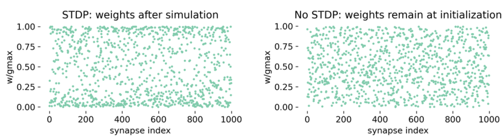
  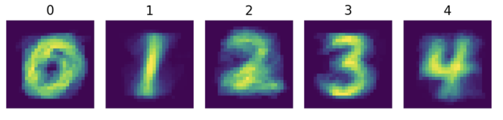

<!--
footer: 'Images: https://www.fabriziomusacchio.com/blog/2026-02-12-stdp/, https://www.fabriziomusacchio.com/blog/2026-02-16-nervos_stdp_snn_simulation_on_mnist/'
-->
# Training : Adaptive synaptic template (AST)
- AST is a synapse-level controller on top of STDP (not a new local plasticity rule).
- STDP still updates weights based on spike timing, but AST regularises and periodically removes or amplifies specific synapses.
- AST encodes "important vs unimportant" features.
- STDP on its own may not converge to weights that cleanly represent input data features, especially in noisy settings.

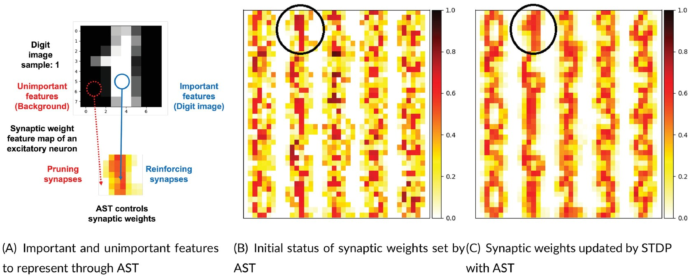
<!--
footer: 'Images: https://onlinelibrary.wiley.com/cms/asset/533057c4-5589-450f-a52f-764139a70df5/coin70001-fig-0006-m.jpg'
-->

# Training : STDP supervised local learning
Paired competing neurons improving STDP supervised local learning in spiking neural networks
- Features are extracted in unsupervised STDP layers.
- A classification layer rewards synaptic weight based on winner-takes-all WTA  neurons aligning with labels.

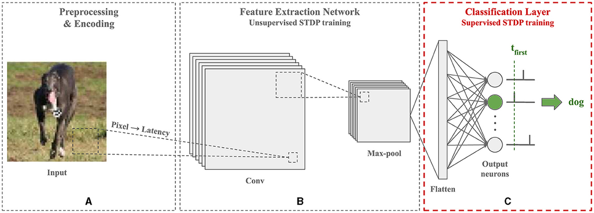
<!--
footer: 'Images: https://www.frontiersin.org/journals/neuroscience/articles/10.3389/fnins.2024.1401690/full'
-->

# Training : Backpropagation with surrogate gradients + hybrid training
- Direct training treats the SNN as a recurrent network unrolled in time, using backpropagation-through-time (BPTT), but replaces the non-differentiable spike with a surrogate gradient (e.g., smooth approximations).  
- Advantages: lower latency than conversion , better control of temporal dynamics, and often simpler optimization than full RNNs due to lighter neuron models.  
- Challenges: training workloads remain heavy, gradient vanishing over long sequences, and spike vanishing in deep stacks.  
- "Hybrid training" initializes from a trained ANN (conversion) and then fine-tunes with surrogate-gradient BPTT, combining robustness of ANNs with temporal efficiency of SNNs.

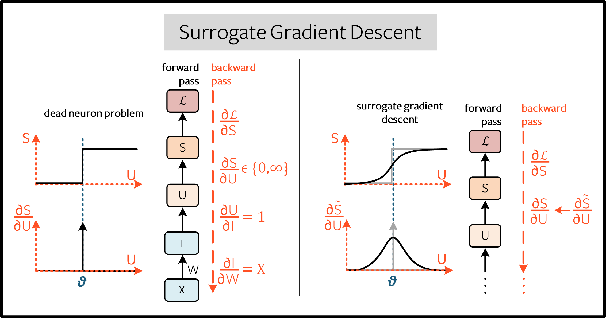
<!--
footer: 'Images: https://snntorch.readthedocs.io/en/latest/tutorials/tutorial_6.html'
-->

# Device variability
- Inaccuracy involved in programming a memristor to a target synaptic weight, so weights learned in high-precision software cannot be mapped directly onto hardware without loss.
- Intrinsic stochastic behaviour is not ideal in many settings, because the same pulse application does not always produce the same conductance update.
- Benchmarking memristors for multiplication applications is difficult because repeatability and controllability across states matter greatly.
- Although many devices support multilevel conductance states, reaching a desired value often requires iterative closed-loop programming, reflecting limited direct write precision.

<!--
footer: ''
-->
# Non-ideal dynamics
- Drift in conductance is a major issue for deep-learning inference, causing classification accuracy to decline over time unless compensated by global scaling or recalibration methods.
- Alongside drift, noise in stored conductance values is a barrier to accurate analog computation in crossbar-based neural accelerators.
- Memristors change state according to the history of applied pulses, and updates are path-dependent rather than ideally linear and instantaneous.
- Accumulative behavior and gradual resistance modulation are useful, but these imply that conductance updates are incremental and device-physics constrained rather than perfectly symmetric or linear.
- Some spike-based schemes can rely on volatile internal device dynamics instead of overlapping pulses of STDP.

# Why these matter
- Variability, drift, and noise directly degrade the fidelity of matrix-vector multiplication in crossbar arrays, which is central to inference accuracy.
- Naive software training produces a mismatch if hardware exhibits stochastic, drifting, or imprecise conductances.
- Memristor systems require tailored learning and inference algorithms because device non-idealities determine possible architectures and training methods.
- Some non-ideal behavior, e.g. stochastic switching, can be exploited for probabilistic computing.

# End to end analog network : conventional neuron
Circuit components and roles
- Volatile Memristor: Acts as a variable, voltage-dependent resistor that controls the integration threshold.
- Capacitor: Stores local electrostatic energy to accumulate charge and build up the firing threshold voltage.
- Pull-Up resistor: Connected directly to the external supply bus. Sets the baseline charging current and protects the memristor from burning out.
- Comparator / Op-Amp: Active electronic component powered by the external supply. Monitors the internal voltage and emits a clean, high-power spike when triggered.
- Issue: Physical capacitors bulky, take up large surface area on a nanoscale silicon chip.

# End to end analog network : AFeFET neuron
- In neuron emulation, AFeFET is used to reproduce leaky integrate-and-fire behavior, where incoming pulses gradually raise an internal state until a threshold-like firing event occurs.
- "Integration" step comes from cumulative polarization induced by successive gate pulses, which progressively increases channel current as the internal state builds up.
- "Leak" step comes from spontaneous depolarization after the pulses stop, so the device state relaxes back without an explicit external reset capacitor or reset circuit.
- Because of built-in relaxation, AFeFET neuron can mimic the temporal decay of a biological membrane potential in compact hardware.
- The reported device achieved tunable firing frequency, low hardware cost, high endurance above 10^12 cycles, and energy consumption around 37 fJ per spike.
- At the network level, the work combined AFeFET neurons with FeFET synapses in a two-layer spiking neural network, reported 96.8% accuracy on MNIST.
- More recent work extends the idea beyond simple firing by using antiferroelectric transistors for reconfigurable neuromorphic functions, including behaviors shaped jointly by polarization and charge trapping.

# Appendix

# Ferroelectric summary

## Domains
Ferroelectric materials are divided into **domains**, which are regions where the spontaneous polarization points in a uniform direction. Different domains can point in different directions, so a sample may have strong local polarization even when its average polarization is small.

## Polarisation
Polarization is the electric dipole moment per unit volume, arising because the centers of positive and negative charge are slightly displaced relative to each other in the crystal. In a ferroelectric, this polarization exists spontaneously below the transition temperature and can be reversed by an external electric field.

## Free energy
The key thermodynamic idea is that ferroelectric order appears because the crystal can lower its free energy by adopting a nonzero polarization state. The free-energy curve shows two symmetrical minima at nonzero polarization.

This double-well picture explains why the material has two stable polarization states and why switching requires an applied field to push the system over an energy barrier. Real materials add complications such as elastic coupling, depolarization fields, defects, and domain-wall energies, so switching often proceeds by domain nucleation and growth rather than a perfectly uniform flip.

## Hysteresis
Ferroelectric hysteresis is the lag between applied electric field and polarization response, usually shown as a polarization-electric field (P-E) loop. As the field is swept forward and backward, the polarization does not retrace the same path because domain-wall motion, nucleation barriers, and internal defects make switching history-dependent.

The hysteresis loop highlights several standard quantities: remanent polarization, which is the polarization left when the field returns to zero, and coercive field, which is the reverse field needed to switch the polarization direction. A wide loop usually indicates stronger retention and larger switching fields, while a narrow loop indicates easier switching but often weaker nonvolatile behavior.

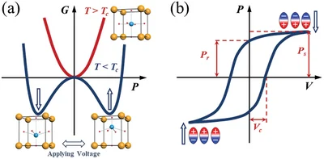

# Anti-ferroelectric Summary
- Anti-ferroelectrics are materials where neighboring tiny electric dipoles point in opposite directions at zero electric field, so the whole material usually has no net polarization even though strong local dipoles are present. 
- Under a strong electric field, the arrangement can switch into a ferroelectric-like state, where the dipoles line up and the polarization becomes non-zero.
- On removing the field, many anti-ferroelectrics relax back to the antiparallel state, which is why they are often described as volatile rather than permanently polarized.
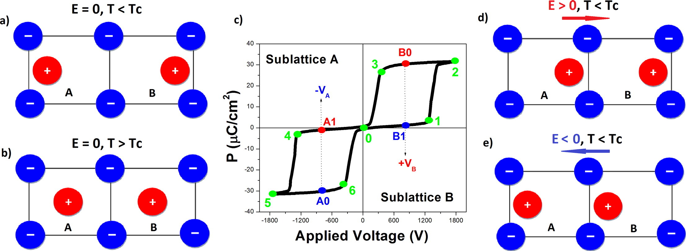

<!--
footer: 'Images: https://www.sciencedirect.com/science/article/pii/S1359646216304742'
-->

# AFeFET
- An anti-ferroelectric field-effect transistor (AFeFET) is a field-effect transistor whose gate stack contains an anti-ferroelectric material, typically a hafnium-zirconium-oxide composition, instead of a conventional passive dielectric.
- The anti-ferroelectric layer can undergo electric-field-induced polarization switching, so the gate does more than electrostatic insulation; it contributes nonlinear internal state dynamics to the transistor response.
- In the reported hafnium-zirconium-oxide device, gate pulses drive a transition between anti-ferroelectric and ferroelectric-like states, which modulates the channel conductance and drain current.
- Unlike a standard MOSFET, the device response depends not only on the instantaneous gate voltage but also on polarization history, because switching and depolarization in the gate stack evolve over time.
- AFeFETs are attractive for neuromorphic hardware because the gate material naturally provides thresholding, accumulation, and relaxation behavior without needing large external capacitors.
- The same anti-ferroelectric transistor platform has also been used for broader reconfigurable neuromorphic functions by combining polarization switching with charge-trapping dynamics.

# Adaptive fully spiking architectures (learnable LIF / XLIF)
- For complex tasks like optical flow, fully spiking encoder–decoder architectures (e.g., Adaptive-SpikeNet, XLIF-EV-FlowNet) allow neuron parameters such as firing threshold and leak to be learnt.  
- Learning these dynamics mitigates spike vanishing in deep networks by adapting thresholds/leaks to maintain sufficient activity across layers and timesteps.  
- Results show significantly lower average endpoint error than ANN baselines at similar model sizes, highlighting the value of learned neuron dynamics in deep SNNs.

# Hybrid SNN–ANN architectures (for ASR, gestures, optical flow)
- Hybrid models use SNN blocks for front-end temporal encoding and ANNs for higher-level feature extraction and longer-time dependencies.  
- E.g. in ASR, SNN convolutional layers replace early CNN blocks, while gated recurrent units (GRUs) remain ANN; this yields low error rates with fewer parameters and substantial energy gains.  
- For gesture recognition, fully SNN, fully ANN and hybrid models are compared; the hybrid achieves the highest accuracy by combining SNN temporal modeling with ANN spatial embeddings.  
- For optical flow, hybrids like Spike-FlowNet and Fusion-FlowNet use SNN encoders (events) plus ANN decoders; multimodal fusion with frame-based ANN paths further improves accuracy and density.  
- Training mixes surrogate-gradient BPTT on SNN layers with standard backprop on ANN layers.
