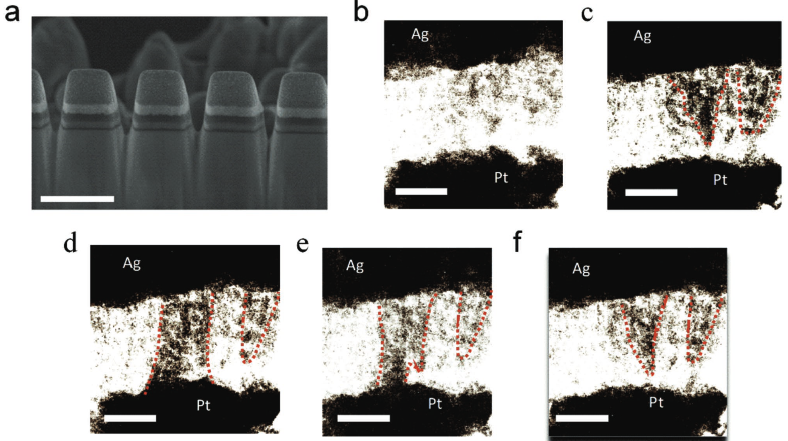
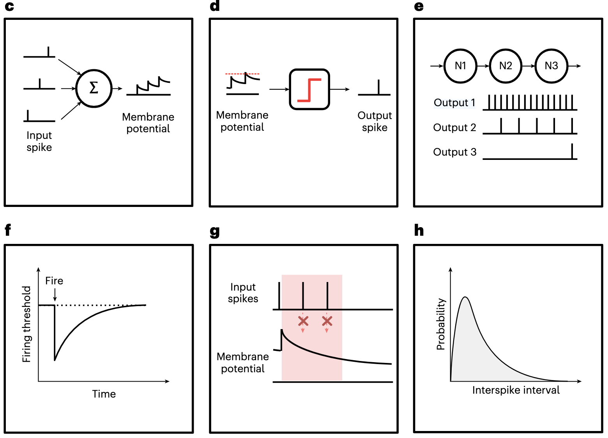
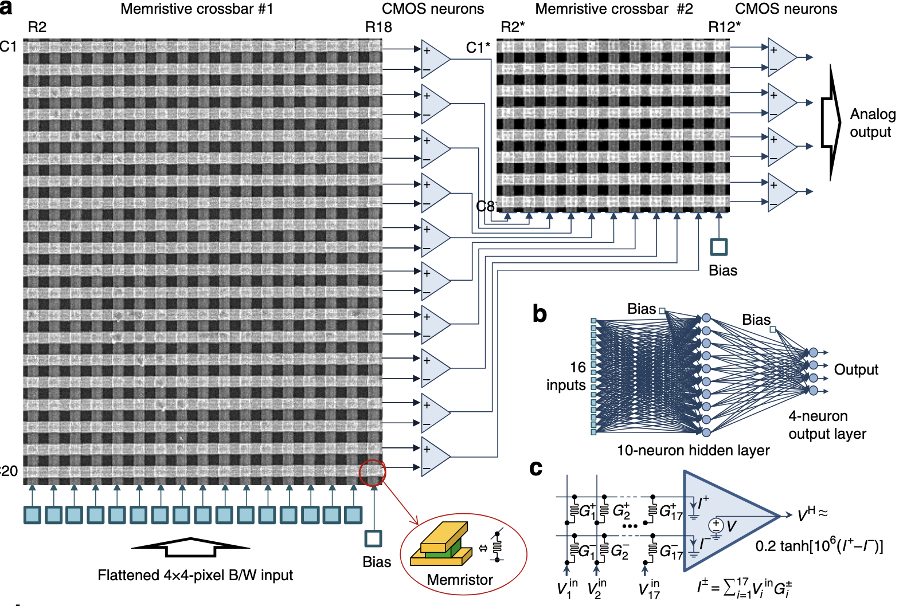
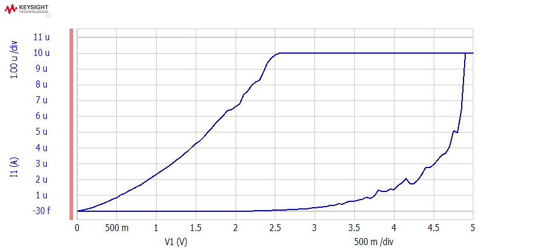
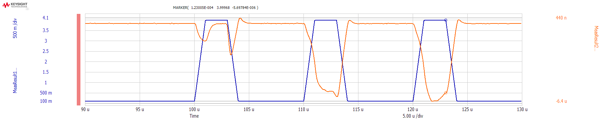
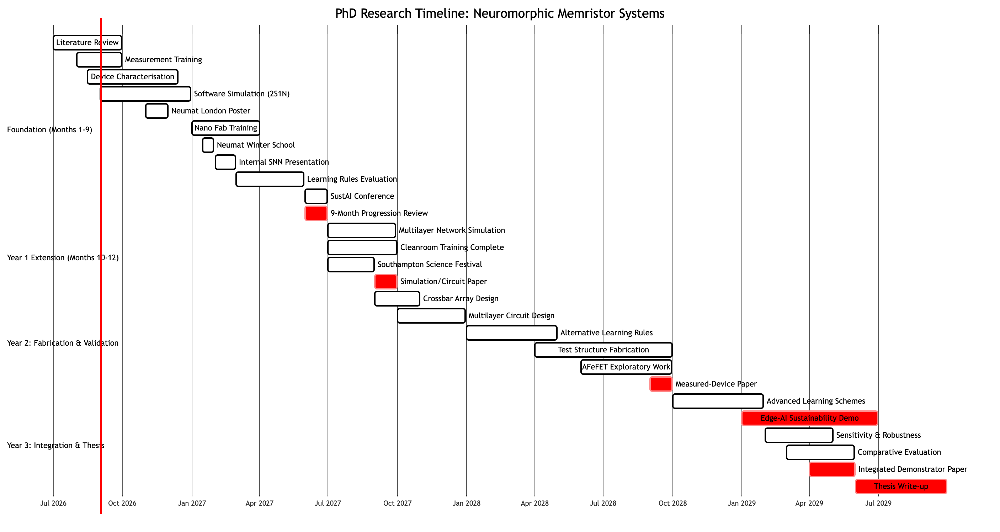

**Programme:** UKRI AI Centre for Doctoral Training in AI for Sustainability, University of Southampton

**Supervisors:** Dr. Firman Simanjuntak and Prof. Mark Zwolinski, University of Southampton.

# Introduction

## Context
In the traditional digital Von-Neumann architecture, data transfers between CPU and external memory can consume 10-100x more energy than the logic operation itself  [@khan_landscape_2024]. By contrast, in-memory computing (IMC) minimises data movement to improve efficiency. The human brain is often quoted as an extraordinary example, with consumption of 20w compared with the kilo- or mega-watts of power needed for a digital computer of equivalent capability.

Neuromorphic "brain-inspired" computers have the potential to perform artificial intelligence (AI) tasks more power-efficiently and with a smaller footprint than digital systems. The term "neuromorphic" was created by Carver Mead in 1990 [@mead_neuromorphic_1990], and early research was on faster computation, with neural networks outperforming traditional Von-Neumann architectures, exploiting natural parallelism and custom hardware. This was used for real-time control, real-time digital image reconstruction, and autonomous robot control. Focus later moved to power consumption and efficiency.

A measure in the field is whether designs are biologically-plausible (e.g. Hodgkin-Huxley or Morris Lecar neuron models), biologically-inspired (replicating behavior of neural systems but not in a biologically-plausible way, e.g. Izhikevich), or artificial neuron models such as Leaky Integrate-and-Fire (LIF) and McCulloch-Pitts (e.g. sigmoid, tanh activation functions) [@schuman_survey_2017].

## Motivation and Significance
The Internet of Things (IOT) requires intelligent information processing in the field, away from powerful and energy-consuming cloud and datacentre-based AI capabilities. Without low-energy local AI inference, very large amounts of data need to be transmitted for central processing, requiring energy, reliable bandwidth and connectivity, latency, and the provision of land, energy grid and water supplies [@jiang_energy_2020]. IOT devices often have a limited energy budget, constrained by energy harvesting and battery capacity. Any lack of energy self-sufficiency requires ongoing human involvement in battery maintenance and replacement.

Machine learning (ML) is a subset of AI that focuses on learning patterns from data to make predictions or decisions. Much current ML research assumes more powerful models running on centralised hardware, with the primary aim of improving accuracy against well-established dataset benchmarks [@thomas_reliance_2022]. Energy demands of frontier models (especially for training) are rising rapidly and will become the limiting factor for further adoption; datacentres cannot be built because of the lack of energy grid and cooling water availability [@chen_electricity_2026].

In contrast, neuromorphic computing seeks to emulate the brain's event-driven, massively parallel processing using energy-efficient hardware models such as spiking neural networks (SNNs). Maass's 1997 paper ("Networks of spiking neurons") is cited as the conceptual foundation for SNNs, and argues that a biologically relevant function which requires hundreds of hidden units on a sigmoidal artificial neural network (ANN) could be computed by a single spiking neuron [@maass_networks_1997].

Memristors are a class of fundamental electronic device proposed by Chua in 1971, and first fabricated by HP Labs in 2008 [@strukov_missing_2008]. Memristors change their resistance as voltage is applied across them, in a volatile (self-reverting) or non-volatile way, and show promise in neuromorphic implementations with bio-plausible behaviour. Updatable non-volatile drift memristors can reflect analog synaptic weights and long-term plasticity, while volatile diffusive memristors can provide short term neuron firing behaviour [@hu_spice_2022]. Memristors are grouped by family; Southampton Zepler has more experience with oxygen-vacancy and metal-filament families (such as Ag/ZnO), but ferroelectric devices (polarization-switching, no-ion-migration) are also the subject of research.

Schuman et al.'s neuromorphic computing survey from 2017 provides a historical overview of learning approaches, hardware/devices, supporting systems, and applications, showing how memristor neuromorphic hardware fits into the broader landscape [@schuman_survey_2017]. A subsequent 2022 article notes limited progress in algorithm-hardware co-design, robustness, and application-driven benchmarks, with an ongoing lack of usable software, hardware, and established benchmarks [@schuman_opportunities_2022].

Recent work has demonstrated memristor CMOS neuromorphic devices with spike-timing-dependent-plasticity (STDP) learning at the synapse level [@bianchi_compact_2020], and small-scale SNNs with in-situ adaptation [@wang_fully_2018], but most demonstrations either remain shallow [@covi_hfo2-based_2016], rely on ex-situ weight programming [@wijesinghe_all-memristor_2018], or requre tight integration with digital neuromorphic platforms such as FPGAs [@javanshir_advancements_2022]. Power consumption for inference in extremely constrained environments is measured, but often only for single devices (synapses, neurons) [@chauhan_ultra_2025], not for complete systems [@zhang_anp-i_2024].

This project aims to extend the applicability of neuromophic computing by demonstrating a larger scale multilayer memristor-based SNN with in-situ learning, and showing how it could be applied to edge AI.

## Research Objectives and Questions

### Objectives
The research has the following objectives:

Build learning-rule simulations using empirical data distributions from physical devices, rather than ideal devices, to show physical credibility.

Design, fabricate, and evaluate a multilayer memristor-based SNN with in-situ learning.

Determine whether analog device characteristics, such as variability, help or harm learning, and how circuit or algorithm design can mitigate it.

Provide at least one practical demonstration for sustainabililty which processes spike-encoded signals and improves a measurable task objective.

### RQ1 - CMOS-Compatible Scalable SNN Architecture
What memristor device, synapse and neuron designs enable a scalable, multilayer spiking neural network that can be fabricated using the CMOS processes available at Zepler? Within this constraint, which crossbar topologies, circuit models (e.g. LIF variants), and spike-routing schemes jointly optimise trainability, energy per spike, and silicon area for edge-scale event-based workloads?

### RQ2 - Efficient In-situ Learning for Multilayer Memristor SNNs
Which in-situ learning algorithms, such as STDP/VDSP and hardware-feasible approximations to spiking backpropagation, can be implemented efficiently in multilayer memristor SNNs, and how do their accuracy, convergence speed, and energy per update compare to ex-situ training with weight transfer under realistic device non-idealities?

### RQ3 - Robustness and Exploitation of Device Variability
What levels of device-to-device and cycle-to-cycle variability in memristor synapses and neurons can a multilayer SNN tolerate before task accuracy degrades beyond a defined threshold, and how can in-situ learning rules be designed so that such variability either remains harmless or actively improves training speed and final accuracy?

### RQ4 - System-level Performance on Event-Based Tasks
Can a fabricated multilayer memristor SNN with in-situ learning achieve competitive task accuracy, energy per event, and latency on representative event-based vision or time-series benchmarks compared with state-of-the-art software ANN/SNN baselines?

# Literature Review
This literature review surveys recent work at the intersection of analog spiking neural networks (SNNs), memristor  devices, and hardware-aware in-situ learning, with a focus on compact device models and fabricated demonstrators.

## Key Themes

### Device-Level Memristor Synapses
Memristor synapses provide non-volatile conductance states with multi-level programmability, enabling in-memory computing and synaptic plasticity in SNNs [@prodromakis_review_2010]. Systems use crossbar arrays of memristors to store synaptic weights [@kim_digital_2012; @wijesinghe_all-memristor_2018; @bayat_implementation_2018] and CMOS neuron circuits to implement spiking dynamics [@payvand_-chip_2020].

Jin et al. provide a broad review of memristor-based networks for neuromorphic computing, covering convolutional, recurrent, and spiking networks [@jin_memristor-based_2025]. Their discussion of synaptic plasticity mechanisms (potentiation, depression, and emerging learning algorithms tailored to memristor behaviour) is relevant to the proposed research in hardware-aware learning rules for SNNs.

Chandrasekaran et al. present a critical review of memristor synapses, combining a statistical survey of neuromorphic device publications (2018-2025) with a discussion of biomimetic properties such as STP, LTP, STDP, and SRDP in various material systems [@chandrasekaran_memristor_2026]. They highlight the range of applications achievable, from MNIST recognition to biomedical interfaces, and show the variety of physical mechanisms that allow synaptic plasticity.

### Device-Level Memristor and Ferroelectric Neurons
The classic Mahowald and Douglas work "A Silicon Neuron" [@mahowald_silicon_1991] provides historical context and a baseline CMOS architecture, but its excessive footprint and static energy has prompted research into compact neurons implemented directly with memristor or ferroelectric devices, achieving rich spiking dynamics while avoid large capacitors and complex reset circuits.

Threshold-switching memristors (TSMs) with volatile or semi-volatile dynamics naturally implement neuron-like behaviours such as oscillations, LIF spiking, and refractory periods through their intrinsic switching physics. Wang et al. argue that mixed-signal CMOS platforms still dissipate 100 pJ/spike and require millimeter-scale footprint, but TSM-based spiking neuromorphic systems offer sub-pJ spiking, 30 ns latency, and nanoscale footprints [@wang_memristor-based_2025]. This proposed research will use volatile TSMs.

Wu et al. present a LIF neuron with a single op-amp that enables online STDP learning with optimised power consumption [@xinyu_wu_cmos_2015]. Their CMOS-integrated design is an early example of dense memristor synapses, and achieves high power-efficiency for STDP in large synapse populations with low integration current.

In 2018, Zhang et al. argue that neuron implementations have lagged behind synapse implementations, because essential biological neural behaviours have not been addressed. They demonstrate LIF, threshold spiking and self-recovery neural features in a single device [@zhang_highly_2018].

Cao et al. fabricate a compact neuron based on an antiferroelectric field-effect transistor (AFeFET) using HfZrO, where intrinsic polarisation and spontaneous depolarisation implement LIF behaviour with high endurance and strong uniformity [@cao_compact_2022]. They model a two-layer SNN combining AFeFET neurons with ferroelectric synapses, reaching high MNIST accuracy, although this is only a simulation.

Chen et al. provide a recent overview of diffusive memristor neurons that emulate integrate-and-fire dynamics through drift and diffusion of metal atoms, and a perceptron network of two separated passive memristor crossbars [@chen_electrochemicalmemristorbased_2023]. Zhang et al. fabricate a compact artificial memristor neuron with leaky integration, automatic threshold firing, and self-recovery in a single device with ultralow energy consumption, providing a device-level LIF neuron building block [@zhang_ferroelectricantiferroelectric_2025].

Zhao et al. fabricate a physical spiking neuron based on one diffusive memristor, one transistor, and one resistor, although the accuracy of a SNN based on this neuron was only determined in a simulation [@zhao_spiking_2025]. However, one attraction of this design is the avoidance of large capacitor energy storage; spikes in deeper network layers are energised by bus voltages.

Wang et al. fabricate a neuron device using a Pt/Ag/ZnO/Pt volatile diffusive memristor that exhibits threshold switching characteristics. They use diffusive memristors to produce LIF functions with low energy consumption, and integrate these neurons into a two-layer spiking neural network for MNIST classification, achieving an 89.17% accuracy [@wang_leaky_2025]. This is directly relevant to the summer project work on Ag/ZnO memristors.

Zhidkov et al. show multiple spiking modes (time-to-first-spike, spike count, firing-rate coding) in Ag/Hf/Zr/O memristor neurons, realised using filamentary switching and a simple series resistor, illustrating how different annealing fabrication processes (post-metallisation and post-deposition) can tune spiking behaviour [@zhidkov_multiple_2026]. Different spiking modes allow flexibility in data encoding choice. Wang et al. analyse threshold-switching memristors and review their use as spiking neurons with oscillatory, LIF, Hodgkin-Huxley-like, and stochastic dynamics, directly linking device physics (Mott vs. redox switching) to neuron models and energy consumption [@wang_memristor-based_2025].

Li et al. fabricate TSMs with 10e6 switching ratios, low threshold voltages, and thermoelectric response, and use a HSPICE simulation to explore spiking responses to temperature variations [@li_threshold-switching_2025]. This work shows how TSM neurons can be integrated with sensor capabilities for edge AI.

Gao et al. enable synaptic and neuron behaviours in the same AFeFET device to allow configurable neuromorphic functions [@gao_reconfigurable_2025]. Shi et al. fabricate a reservoir computing system with coplanar floating-gate antiferroelectric transistors that bring together volatile neuron-like spiking, nonvolatile synaptic behaviour, and fading-memory reservoir dynamics in a single device architecture [@shi_coplanar_2026].

### Multilayer Neuromorphic Perceptron Architectures
Passive memristor crossbars (0T1R) and active 1T1R arrays underpin many in-memory computing architectures for ANNs and SNNs, providing high-density weighted-sum operations and local update paths. Bayat et al. demonstrate a one-hidden-layer perceptron classifier implemented entirely in mixed-signal hardware using two passive 20x20 metal-oxide memristor crossbars, with off-chip training and a classification fidelity close to simulations despite device non-idealities [@bayat_implementation_2018].

Tang et al. design a fully memristor spiking-neuron learning framework built from a one drift, one diffusion memristor model, eliminating the need for other electronic devices like resistors or capacitors. They apply the framework to a feedforward multilayer perceptron, to demonstrate its simplicity and high processing speed on hardware, but only implement it with FPGAs [@tang_fully_2020].

Poddar et al. report ultra-high density perovskite nanowire array memristors for multi-layer perceptron networks, emphasising nanowire crossbars as a path to extremely compact synaptic fabrics [@poddar_ultra-high_2026].

A recent hybrid convolutional SNN architecture by Go and Kim combines digital non-leaky integrate-and-fire neurons with commercially-available Knowm memristor-based synapses in a 1T1R crossbar, using a current-sense amplifier and 1-bit comparator as a minimal readout instead of high-resolution ADCs [@go_energy-_2026]. They use a temporal encoding scheme to reduce spike counts and device stress, and they highlight the energy usage compared with conventional ADC-based designs.

### Learning Rules and In-Situ Training in SNNs
Biological and bio-inspired plasticity rules such as spike timing dependent plasticity (STDP), Hebbian learning, and voltage-dependent synaptic plasticity (VDSP) are central to in-situ learning in SNNs for local learning using device physics.

Diehl and Cook are first to show unsupervised digit recognition using STDP, lateral inhibition, and adaptive thresholds without any labels or teacher signals in 2015, achieving high MNIST accuracy and showing the robustness of biologically plausible mechanisms across different learning rules [@diehl_unsupervised_2015]. Published memristor-CMOS neuromorphic chips have since demonstrated in-situ STDP learning in synapses [@karamimanesh_fully-cmos_2026], basic pattern recognition [@tavanaei_bp-stdp_2018], and small-scale neural cores [@valentian_fully_2019].

Goupy et al. introduce Stabilized Supervised STDP (S2-STDP) / Paired Competing Neurons (PCN), integrating error-modulated weight updates with local spike timing and intra-class competition [@goupy_paired_2024]. They demonstrate improved performance over previous supervised STDP rules across multiple vision datasets.

Recent work by Limbacher argues that SNN with Hebbian learning can be used for computation as well as for classification, improving out-of-distribution generalisation, one-shot learning, and reward-based learning [@limbacher_memory-dependent_2025]. Their design is based on a store-recall loop, and proves to be effective in memory card games.

Co-design for edge AI focuses on learning algorithms adapted for memristor constraints such as limited write endurance, stochastic switching, and restricted dynamic ranges [@go_energy-_2026]. Hybrid schemes split feature extraction (often unsupervised STDP) from supervised classification layers, and modify learning strategies to minimise the number of write operations [@kugele_hybrid_2021].

### Neuromorphic Reservoirs and All-in-One Architectures
Reservoir computing offers a flexible framework for temporal information processing using fixed recurrent substrates and trained readouts, which maps well onto analog device arrays with rich internal dynamics [@tan_dynamic_2023; @park_ferroelectric_2025; @shi_coplanar_2026].

Kim et al.'s self-powered multimodal system integrates multimodal sensing, spike encoding, and unsupervised learning using drift and diffusive memristors, operating without digital circuitry or external power. It usses a SNN that directly receives multiple analogue inputs from physical sensors and converts these inputs into spike-like signals, which then modulate synaptic weights based on relative event timing [@kim_self-powered_2026].

## Key Challenges Indicated by Literature

Digital systems overcome device and cycle variability by forcing binary alignment. But in analog components, like memristor crossbars, device variability and imperfections cause weight noise, conductance drift, and cycle-to-cycle fluctuations that degrade inference accuracy and complicate training. Non-linear synapse weight updates, asymmetric potentiation/depression, retention loss and endurance limits further complicate training approaches.

For SNN, non-differentiable spiking requires alternatives such as surrogate gradients (SG) or ANN-to-SNN weight conversion. SG introduces approximation bias, is memory-intensive for backpropagation-through-time (BPTT), and has poor biological plausibility. Although biologically plausible alternatives, such as STDP, are scientifically interesting, they have historically underperformed SG in accuracy.

There is no consensus on computational primitives, such as rate vs. temporal vs. population encoding, integrate-and-fire vs. Izhikevich vs. Hodgkin-Huxley neuron models, and local vs. global learning.

There is a generalization gap: SNNs perform on temporal or sparse tasks but lack the demonstrated capabilities of transformer-based digital NNs, recurrent NNs, and convolutional NNs. As yet, there is no killer application justifying neuromorphic large-scale production cost, requiring an investment of more than 50M USD, although some low-power microcontroller and neural processing units (NPU) are in production for edge AI applications e.g. Texas Instruments' TinyEngine NPU.

## Synthesis
Prior research shows strong activity in device-level memristor and ferroelectric neurons and synapses, ferroelectric LIF neuron design, threshold-switching memristor-based spiking dynamics, and mixed-signal memristor crossbar demonstrators. It also includes several hardware-aware learning schemes; unsupervised STDP, supervised STDP variants, Hebbian-driven networks, and endurance-aware co-design, but these are studied either in simulation or with limited in-situ learning in small arrays.

Compact device models are commonly used in circuit-level simulations (e.g., HSPICE models, compact neuron models for memristor and ferroelectric devices), yet there remains a gap in unified compact models that simultaneously capture neuron dynamics, synaptic plasticity, and non-idealities for multi-layer analog SNNs. Fabricated demonstrations often focus either on device-level proof-of-concept (single neurons, small crossbars, reservoir layers) or on mixed-signal systems with off-chip training; fully analog, multi-layer SNNs with hardware-aware in-situ learning remain comparatively underexplored.

The literature indicates that key open problems include handling device variability and stochasticity, designing plasticity rules compatible with endurance limits, integrating memristors in multi-layer analog SNNs, and demonstrating small yet complete hardware prototypes that close the loop between learning, device physics, and circuit behaviour.

### Gaps and Originality
There is a clear gap in demonstrating multilayer memristor SNNs with in-situ learning, as existing memristor implementations tend to focus on single-layer cores or small networks.

The proposed research, "hardware-aware in-situ learning in an analog SNN using measured memristor synapses and neurons, with a compact device model and a small fabricated demonstrator", naturally builds on earlier work by combining measured device characteristics, compact unified models, and in-situ learning rules tuned to device constraints.

The significance of the research is that if in-situ learning for SNN can be shown to accommodate or even benefit from real-world device variability, the low-power design could benefit edge AI immediately, and scale to larger AI models with further research.

# Proposed Methodology

## Methodological Overview
The research will follow parallel logical and physical streams. The logical stream will front-run the physical one, and will inform it, so that physical research (which generally has higher costs and longer leadtimes) is more likely to succeed.

The overall plan is to start with physical single-device characterisation. The device data obtained will be used to model a simple network in software, and then apply learning rules and assess performance in software, before an equivalent physical network is built. The same learning rules will then be tested in hardware.

The next progression is to repeat this process for a more complex network, aiming for a multilayer perceptron.

### Diffusive and Drift Memristor Characterisation
Existing fabricated diffusive and drift memristors will be probed to characterise device behaviour, with a particular focus on device-to-device, cycle-to-cycle and stochastic variability.

Data collected will include IV curves, switching and volatile behaviour, endurance, retention, and variability, and this will be used to fit compact models suitable for both circuit and network-level simulation.

### Device and Circuit Design
The variability model will be implemented in a software simulation of a single, simple neuron, converting memristor variability into neuron behaviour variability.

Existing Zepler memristor expertise will be used to select, design and fabricate memristor stacks with suitable characteristics (tuning, endurance, variability, and process compatibility).

{#fig-pulse}

Hybrid synapse cells (e.g. 1S1R) and neuron circuits (e.g. LIF 1M1T1R neurons) will be designed that operate at realistic voltage ranges and support pulse-based conductance updates implementing STDP/VDSP or supervised learning rules.

### Compact Modelling and Simulation
SPICE/Verilog-A simulation will be used to validate synapse and neuron behaviour, including parasitic effects and sneak paths. This approach will then be applied to a larger network, where feature extraction and differentiation becomes important. Variability will be assessed for whether it assists in feature / node differentiation, or whether there is a point at which excessive variability becomes catastrophic for network performance.

These models will be integrated into a whole-scale simulation stack, linking device-level dynamics to spiking network behaviour, using Python SNN frameworks for training and analysis.

### In-Situ Learning Schemes
In-situ learning (STDP and VDSP) will be simulated in software, for single, simple neurons (pre/post-synaptic), initially without variability. Later, the variability statistical model will be added. The impact of variability on learning speed and accuracy will be measured, and this will inform a specification for acceptable device and cycle variability.

Unsupervised STDP/VDSP-based learning will be implemented in hardware using local timing and pulse protocols which update memristor conductances based on spike correlations and presynaptic potentials. This learning approach may be compared to supervised learning schemes adapted to hardware, such as approximate backpropagation in the spiking domain, where error signals are encoded as additional spike trains or weight-update pulses.

Ex-situ training (software SNN trained first, then weights programmed into crossbars) will be compared to in-situ training (updates performed directly in hardware) under realistic device constraints.

## Data, Resources, and Infrastructure
The following resources are needed:

- ECS Zepler 4th floor measurement lab: MEMS probe station for DC and pulse tests of individual devices.
- Breadboard / pulse generator / oscilliscope / packaged devices: simple circuit testing.
- Zepler Nano Fabrication Lab: photo lithography, ALD thin-film deposition, lift off, annealing, etc.

If nanofabrication became unavailable, the research _could_ be limited to simulation and measurement of existing devices, but physical implementation will provide greater plausibility and technology readiness.

## Evaluation Strategy
Key metrics for evaluation include accuracy, energy per event, latency, and robustness on chosen tasks; these will be compared across SNN hardware and software baselines using consistent datasets.

Sensitivity analyses will be performed to quantify the impact of device variability, limited conductance precision, and learning rule parameters on long-term performance and stability.

## Risks, Assumptions, and Limitations

### Risks

- **Fabrication available:** The risk that although fabrication is required, timely training on necessary tools is not available due to trainer unavailability, or that training is ineffective and fabrication is incompetent and skills remain insufficient, or that fabrication tools are overbooked or suffer failure and downtime. **Mitigation:** Wherever possible, use existing devices in preference to fabrication. Consider outsourcing fabrication to ECS Partners (Zepler) or Von Ardenne (industry partner with fabrication capabilities), or the loan of devices from other research institutions.
- **Devices unsuitable:** The risk that existing volatile memristor designs for which Zepler has fabrication experience are not suitable to implement neurons, either because the device-to-device variability is too high, the spiking behaviour is incorrect, or the endurance is poor. **Mitigation:** Consider alternative neuron implementations, either using different materials e.g. HfO, or different behaviours e.g. AFeFET.
- **Crossbar effects:** The risk that devices work individually, but not when fabricated into a dense array, e.g. crossbar synapses, due to unmanageable side-effects such as sneak-path currents. This risk field is well understood, but optimum solutions like 1S1R are still the subject of research. **Mitigation:** Consider alternative, more established management approaches, e.g. 1T1R, even if suboptimal from a space/energy perspective.
- **In-situ learning:** The risk that in-situ learning approaches, e.g. STDP, don't translate to hardware without a large accuracy drop, due to device non-linearity and variability. **Mitigation:** This is one of the research goals, so absolute mitigation is not required, but an advanced indication can be provided through effective, software simulation of devices and learning approaches using detailed device behaviour from careful characterisation and measurement.

### Assumptions

**Fabrication budget and training:** The assumption that fabrication is possible and practical, that budget exists and training will be received. **Validation:** Previous ECS PhD students have followed this path and achieved research within established budgets.

## Skills Audit Training Needs

| Skill / capability gap | Why it matters | Planned training or action | Indicative timing |
|---|---|---|---|
| Device measument | Needed to characterise devices for software simulation | B53 measurement lab induction, training | Sept 2026 |
| Device fabrication | Needed to fabricate devices for physical evaluation | B53 nano fab lab induction, tool training | Oct-Dec 2026 |
| Foundational understanding of nano-electronics | Underpins memristor behaviour | Audit ELEC3207 or ELEC2312 module | Semester 1, 2026 |
| Software development | Needed to assess and develop SNN libraries | None required | N/A |

# Impact Assessment

## Overview of Anticipated Impact
This impact assessment evaluates the societal, ethical, and environmental implications of developing an analog spiking neural network (SNN) that integrates measured memristor synapses and neurons with a compact device model for hardware-aware in-situ learning.

By 2030, AI global data centres using digital hardware are projected to consume around 945 TWh of electricity annually, while their associated water footprint could equal the basic domestic water needs of 1.3 billion people and their land footprint could exceed 14,500 km2 [@de_vries-gao_carbon_2026], loading power grids, competing with households and agriculture for scarce water, and consuming land for facilities, power generation and transmission networks.

These impacts are unevenly distributed: communities hosting data centres may face higher utility costs, local water stress, noise and construction impacts, while the benefits of AI accrue disproportionately to technology companies and wealthier users. The problem is intensified by everyday inference and deployment, which the UN University analysis estimates account for roughly 80-90% of total AI energy demand, rather than training alone [@aczel_environmental_2026]. Consequently, without limits on efficiency, siting, disclosure and resource use, AI development could deepen environmental inequality by shifting the ecological costs of digital services onto regions least able to absorb them.

By co-locating memory and processing into event-driven analog memristor crossbars, this research can address the "Von-Neumann bottleneck", offering energy efficiency orders of magnitude higher than conventional digital hardware (GPUs/TPUs). Spiking neural networks process information sparsely and can potentially reduce computation, data movement and network traffic in applications such as continuous sensing and environmental monitoring. This could lower operational electricity demand and reliance on cloud infrastructure, and indirectly reduce associated cooling-water and data-centre land requirements. However, neuromorphic hardware manufacturing, preprocessing, communications and end-of-life impacts must also be included, and like-for-like measurements are needed before a net life-cycle advantage can be claimed [@aral_promise_2024].

Additionally, making the transition of analog neuromorphic computing from lab prototypes to production deployment introduces complex trade-offs across sustainability, reliability, and governance. The benefit of memristor neuromorphic systems will depend as much on robust RRI governance, standardized testing, amelioration of device drift and variability, and sustainable material supply chains as it does on raw power efficiency gains.

## Considerations Under the 4Ps Framework
The 4P dimensions cover Process, Product, Purpose and People. Considering these in turn:

### Process
The research is carried out predominantly in the Zepler cleanrooms of the university. The focus will be on developing a documented and repeatable device measurement and fabrication process, with minimum waste of rare earth minerals and metals, and devices fabricated only at the point of need (no stock waste). Established recipes will be used to maximise yield. There aren't considered to be any significant data management risks or ethical issues, and consent is not required. Widely-adopted test datasets will be used, which contain no personal information. The standard Zepler governance process and rules will be followed at all times. Lab safety is an extremely important consideration, since many of the fabrication chemicals can be harmful, so a full programme of safety induction and specific process training will be followed.

In-situ learning enables local adaptation directly on edge hardware without transmitting raw sensor streams (video, audio, biomedical signals) to centralized servers. This "privacy-by-default" architecture aligns with strict data protection regulations (e.g., GDPR) by keeping sensitive personal data local and volatile.

### Product
The research outputs (algorithms, devices, platforms, datasets, papers) will be made public, with test specifications and results available through a Creative Commons license to enable reproducibility of experiments. A successful conclusion of research will lead to working prototypes at a low Technology Readiness level (likely TRL 3: Analytical and laboratory proof-of-concept tests are completed). A prototype may be capable of simple classification and other machine learning tasks, but will not outperform the accuracy of conventional digital artificial neural networks, and will not be directly usable.

Longer term, it is anticipated that the technolgy may deliver AI to low-power edge devices, and this should be put to beneficial uses, such as environmental monitoring, but also undesirable ones, such as drone warfare. Low-power in-situ intelligence significantly expands the capabilities of untethered autonomous systems, including micro-drones and target-tracking sensors. The low thermal and power signature of memristor SNNs makes them inherently attractive for defense systems, raising non-proliferation concerns and ethical challenges regarding Lethal Autonomous Weapons Systems (LAWS). It's not possible to control the technology so that it could only be used in positive use-cases. Another consideration is the ability to audit or constrain behaviour, but neuromorphic systems face the same challenges as digital AI counterparts.

### Purpose
The research will align with the public-interest goals of improving health and increasing sustainability of human activity. The main driver is to seek a plausible reduction in the energy consumption of AI training and inference, and a consequent consumption of cooling water, although neuromorphic computing is as a whole at a very low readiness, and so the contribution may not emerge for a decade or more.

### People
The primary impact on people for the duration of this project is on researchers. It's premature to consider end-users or affected communities in detail (e.g. workers displaced by more capable automation, or people subject to always-on sensing), since the technology is at a very early readiness level, but the intention is to benefit communities through alignment with sustainable development goals.

**Device physicists & chip designers:** Responsible for characterization accuracy and compact model fidelity; must prioritize reproducible physical metrics over optimistic simulation benchmarks.

**Semiconductor foundries:** Require standardized back-end-of-line (BEOL) integration processes to ensure scalable manufacturing without introducing heavy-metal contamination to cleanrooms.

**Edge application developers:** Benefit from localized learning capabilities; must design compensations against analog drift and handle non-deterministic hardware behaviors.

**Regulatory bodies & policy makers:** Need to establish safety standards for analog/neuromorphic AI chips, ensuring hardware calibration and accountability in safety-critical deployments. Need to help policy makers (e.g. politians) understand the relevance of low-power AI in an era of increasing public scepticism of the environmental impact of AI.

## Considerations Under the AREA Framework

### Anticipate
The project proactively models hardware non-idealities-such as cycle-to-cycle conductance variation, random telegraph noise, and thermal drift, before physical scale-up. It is anticipated that device-to-device variability may lead to slow progress, and other neuromorphic research projects have remained stuck in the examination of single devices rather than complete systems. To mitigate this, the project will use established recipes and work with proven recipes, rather than optimise the devices themselves.

Memristors exhibit non-volatile state degradation over extended write cycles. If an analog SNN adapts continuously in-situ without strict stability bounds, device degradation could lead to unpredictable weight shifts. In safety-critical applications, like bio-implantable medical monitors or driver-assist sensors, uncalibrated drift introduces severe safety hazards.

### Reflect
The project must reflect on the hype cycle surrounding neuromorphic engineering. Demonstrations on "small fabricated prototypes" must be evaluated critically regarding scalable yield, CMOS compatibility, and realistic manufacturing costs rather than assuming frictionless commercial adoption. Sustainability is embedded in the project, with a total focus on reducing the energy, water and land consumption of AI, and the associated carbon emission and climate change impacts.

Analog SNNs offer transformative reductions in operational energy consumption, but their total environmental footprint includes embodied emissions and material toxicity from advanced fabrication.

### Engage
Development requires cross-disciplinary dialogue between material scientists, laboratory technicians, computer scientists, and domain-specific end users (e.g., medical device designers, environmental sensor operators) to align hardware constraints with human safety requirements.

To make neuromophic computing a reality and advance it to the point of societal benefit, further funding will be required. Engagement with funding authorities such as UKRI and policy makers such as UK parlimentary committees is needed, at all times demonstrating that research monies are being spend responsibly.

Outreach activities are being planned, such as the British Science Festival in Southampton in 2027, where the concepts of modelling computers on the human brain could be demonstrated (such as a LED-powered synapse, or a water-level neuron trigger model) to inspire future scientists.

### Act
Hardware-aware models must be adapted as fabrication of alternative material stacks (e.g., transition from HfO to TaO layers) becomes possible, or other devices (e.g. Anti Ferroelectric transistor devices for neurons) are proven, ensuring algorithms remain grounded in empirical physical behavior.

## Relevant Sustainable Development Goals
| UN SDG | Title | Direct Impact | Key Mechanisms & considerations |
|---|---|---|---|
| SDG 7 | Affordable & Clean Energy | High Positive | Cuts compute energy by 10x to 100x via sparse, event-driven spike processing and local analog weight updates, reducing grid strain from AI workloads. |
| SDG 9 | Industry, Innovation & Infrastructure | High Positive | Enables energy-harvesting edge IoT devices, autonomous sensors, and decentralized infrastructure monitoring without relying on power-hungry cloud data centers. |
| SDG 12 | Responsible Consumption | Moderate Negative / Mixed | Memristor fabrication often utilizes novel transition metals (Hafnium, Tantalum, Titanium). Scaling requires strict e-waste lifecycle management and sustainable chemical etching protocols. |
| SDG 13 | Climate Action | Positive | Mitigates the growing global carbon footprint of artificial intelligence training and continuous edge inference ecosystems. |

Overall, responsible research and innovation (RRI) principles are being considered to ensure that technological advances in neuromorphic systems align with societal values and long-term risk management.

# PhD Plan

## Overview of Direction
The overall goal for the research is to first measure and understand existing device behaviour, then construct simple end-to-end systems from them, then understand how local in-situ learning rules are affected by device variability.

The approach is to reuse known device structures and fabrication recipes (supervisory knowledge), and _not_ to experiment with novel fabrication layers or materials per se. Pulse characterisation, automation, data schemata, analysis, and circuit test preparations should be completed before fabrication.

Ideally, the learning rule evaluation should direct what devices are required, rather than the availability of devices driving the rule evaluation.

## First 9 Months

### Goals:

The initial goal is to characterise pre-made drift (synapse) and diffusion (neuron) memristors using the MEMS probe station, and conduct I/V DC, set / reset behaviour, and pulse tests, noting spiking behaviour and device-to-device variability. Then, define a pulse specification corresponding to a spiking dataset, e.g. N-MNIST, and connect a custom pulse generator to the probe station.

The next goal is to construct a multilayer spiking neural network software model for laptop execution with 60,000 test samples and 5,000 events per sample, and model the first level of device behaviour; e.g. spiking charge threshold, refractory behaviour, minimum and maximum conductance.

The following goal is to chose a device material, specification and fabrication recipe for fabrication of synapse and neuron devices, and to package the devices for breadboard deployment. Then design and construction of a simple 2-synapse, 1-neuron model on a breadboard, and evaluate in-situ learning rules (spike timing dependent plasticity, voltage dependent synaptic plasticity).

### Detailed Plan
| Month | Planned activities | Deliverables / milestones |
|---|---|---|
| 1 | Complete formal literature review on memristor neuromorphic devices, in-situ learning in SNNs | Review |
| 1-2 | Measurement training (MEMS, Pulse, Cascade) | Ability to characterise devices |
| 4-6 | Nano fab training | Ability to fabricate devices |
| 3 | Poster / participation at Neumat London November 2026 | Poster |
| 2-5 | Characterise synapse and neuron devices | Library of measurement settings and methods, and device behaviour data |
| 5 | Internal presentation on Spiking Neural Networks to SustAI cohort | Presentation |
| 3-6 | Build software simulation of 2 synapses / 1 neuron, incorporating actual device variability dimensions and data | Data for simulated behaviour of system |
| 6-9 | Evaluate in-situ learning methods, showing device variation impact | Learning performance (accuracy, rates, energy consumption) |
| 6 | Poster / participation at Neumat Winter School 2027 | Poster |
| 8 | SustAI conference | Presentation |
| 9 | Preparation for 9-month progression review | Review paper |

## Year 1 Month 10-12 Goals

Beyond the 9-month milestone, the goal is to complete the simulation of a multilayer network, in order to assess learning performance (accuracy, rates, energy consumption). Additionally, all cleanroom training required for circuit fabrication will be completed.

Southampton Science Festival 2027 provides an outreach activity based on school-friendly neuron-model demonstrations.

A simulation/circuit paper that does not depend on successful fabrication will be published.

## Year 2 Goals

A crossbar array design will be selected to reduce sneak path currents (e.g. 1S1R, 1T1R etc.). Larger, multilayer memristor synapse and neuron circuits will be designed, including the layout of small crossbar synapse arrays.

Alternative in-situ learning approaches (e.g. STDP, VDSP etc.) will be evaluated.

Fabrication of test structures at Zepler will be completed, and if time allows, exploratory work on AFeFET-based synapse/neuron concepts will be undertaken.

A paper on measured-device performance will be published.

## Year 3 Goals

Further development of in-situ learning schemes (STDP, VDSP and supervised variants) will be undertaken.

Hardware-based learning for small edge-AI tasks aligned with sustainability (e.g. environmental sensing) will be assessed, and the in-situ learning will be compared with software SNN baselines.

Sensitivity and robustness studies will be published, including the performance of an integrated demonstrator.

Finally, results will be consolidated, and a defensible thesis written.

## Gantt Chart

## Meeting and Supervision Plan

Weekly face-to-face meeting with Dr. Firman Simanjuntak and Prof. Mark Zwolinski

## Contingency Planning

By March 2027, evaluate whether reliable access to a device dataset exists which could support a publishable hardware-aware learning result by March 2028. If so, proceed with integrated device-circuit-algorithm development; if not, pivot from fabrication to variability-aware learning rules.

# References
::: {#refs}
:::
